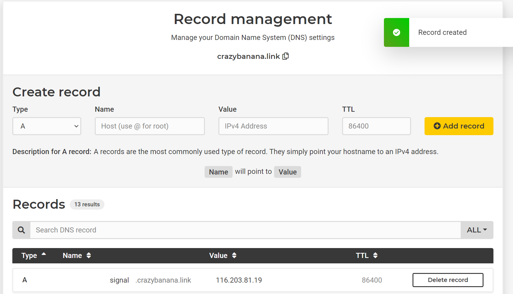

# Signal TLS Proxy with Terraform on Hetzner

Setup Signal TLS Proxy on Hetzner with Terraform

## Precondition

* [Hetzner Cloud Console](https://accounts.hetzner.com/login) Account
* Domain with the possibility to change DNS Records
* Installed [Terraform](https://learn.hashicorp.com/tutorials/terraform/install-cli)

## Quickstart

1. To get started you first need an API token. Sign in into the [Hetzner Cloud Console](https://accounts.hetzner.com/login) choose a Project, go to Security → API Tokens, and generate a new token.
2. Create a file with **terraform.tfvars** in the folders bootstrap and cert with the API Token from step 1 and your domain.

       hcloud_token = "aaaaaaahfhajsdjsjhasdhkjasdhkasd"
       domain = "your.domain.com"
 
3. In the folder bootstrap run following commands

       terraform init
       terraform apply -auto-approve

4. (Optional but Recommended) Check if the bootstrap works, open in the browser http://\<IP\>:8080 and check if you see a nginx welcome screen

5. Now login in your Domain Provider and set an A-Record to your server.
Each Domain Provider looks different, I can only give you a high level description

   * Go to your Domain Provider and click on your domain
click on Manage DNS
   * Add a new Record
   * Click on A Record
   * Enter the IP (server ip from step 3) in the value field
 
   Hetzner Example:
   
   

6. (Optional but Recommended) Check if you see the nginx welcome screen with http://<YOUR_DOMAIN>:8080 

7. In the folder cert run following commands

       terraform init
       terraform apply -auto-approve

8. Enjoy your Proxy "https://signal.tube/#<YOUR_DOMAIN>"

## Price

The smallest Server on Hetzner CX11 costs 3,92 €/Month

## TLS Proxy

https://signal.tube/#signal.crazybanana.link